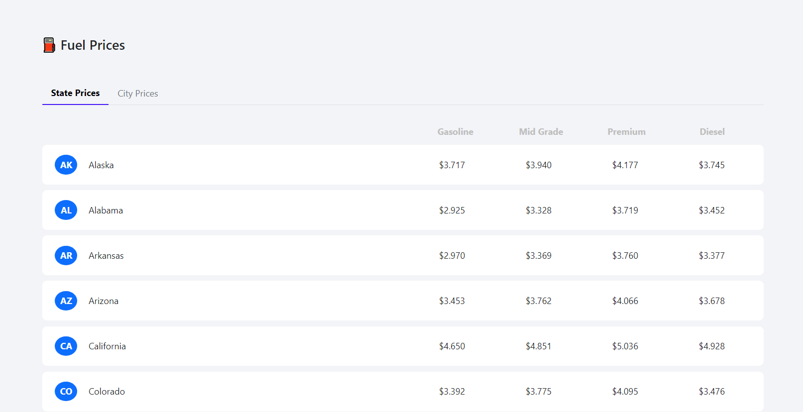
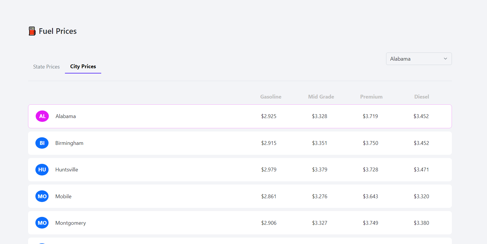

# Fuel Prices App

## Description

This project is a web-based application designed to display fuel prices across various states in the USA. It utilizes Meteor.js for the backend and Blaze for the frontend. The application allows users to view and compare fuel prices by state and, optionally, by city. The app uses the [Fuel Price API](https://collectapi.com/tr/api/gasPrice/akaryakit-fiyatlari-api) to get the fuel prices.

## Features

- State Prices View: View and compare fuel prices for different states in the USA.

- City Prices View: Optionally, view fuel prices for cities within a selected state.

- Dynamic Data Loading: Fetches fuel price data from an external API and updates the UI dynamically.

- Responsive Design: User interface adapts to different screen sizes.
  Technologies Used

- Meteor.js: Backend framework for building real-time web applications.

- Blaze: Frontend templating engine used for rendering HTML.

- ReactiveVar: Reactive data sources used for managing state and updating the UI.

- External API: Data is fetched from a remote API to provide real-time fuel price information.

- Bootstrap: Frontend framework used for styling and layout.

## Installation

### 1. Clone the repository:

```bash
git clone https://github.com/ismetcanbyk/fuel-prices-app.git
cd fuel-prices-app
```

### 2. Install dependencies:

```bash
meteor npm install
```

### 3. Configure API Settings:

Create a settings.json file in the root directory of the project and add your API token. This file is used to configure the API token for fetching fuel prices. You can use the sample file.

```json
{
  "API_TOKEN": "YOUR_API_TOKEN"
}
```

### 4. Run the application:

This will start the server and apply the settings specified in the settings.json file.

```bash
npm run start-settings
```

## Photos




